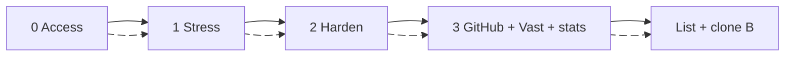
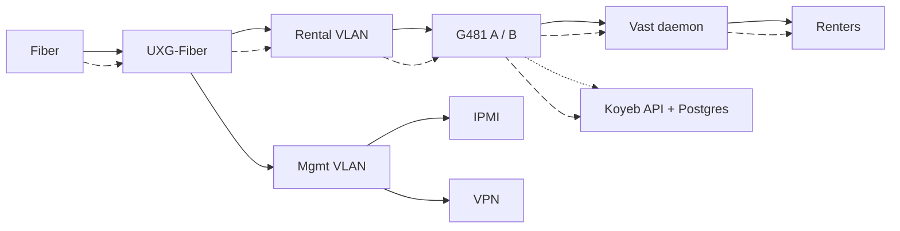
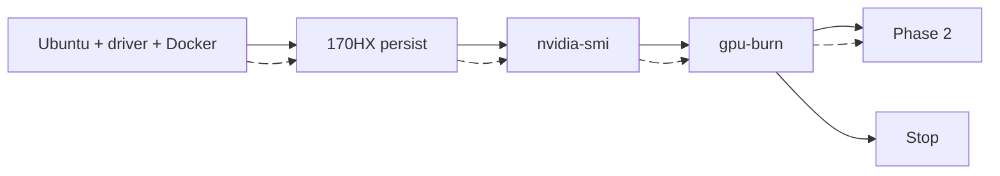
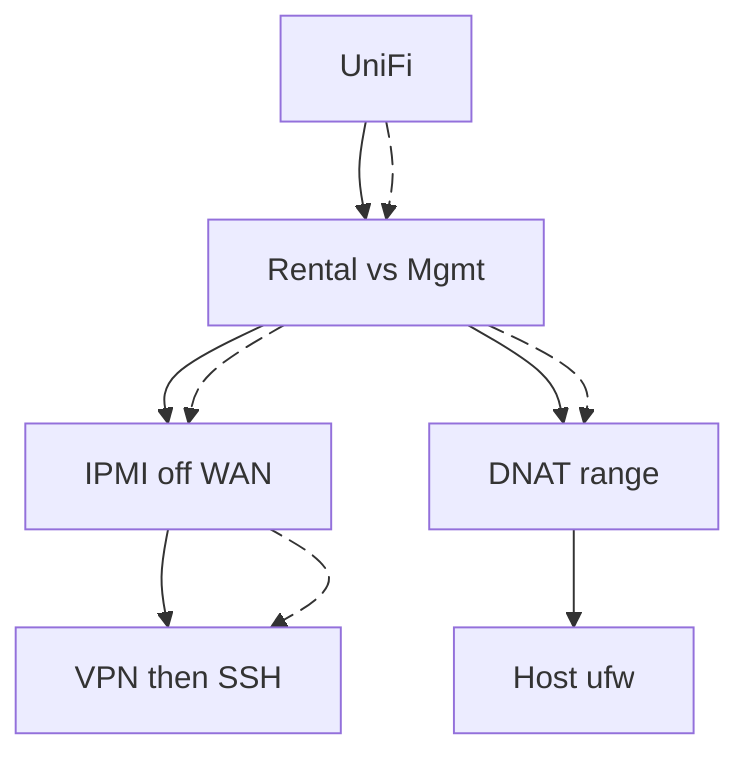
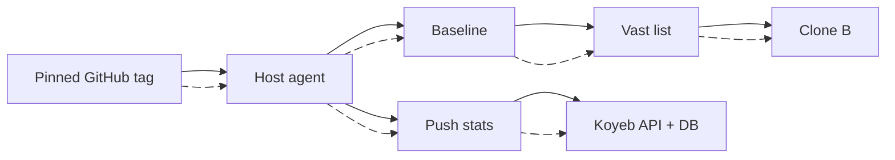
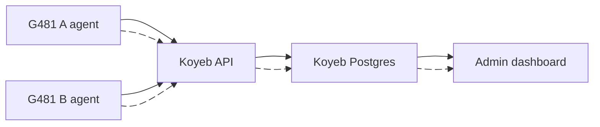

# Bryan x Eqan Ahmad

Linux / Docker / Python | Two G481-HA0 hosts on Vast.ai

**Positioning:** Burn, harden, pin and list. Stats live off the GPU hosts.

<!-- CLEAN_DECK_REMOVE_START -->
**Say:** "Three phases. Thin Ubuntu plus Docker, then gpu-burn. Then UniFi, IPMI, SSH. Then GitHub pin, Vast list, clone B. A small agent on each G481 pushes stats over HTTPS to a Koyeb API plus Postgres. Dashboard is login on Koyeb. No Postgres on the rental GPUs. If Koyeb is down, Vast rentals keep running."
<!-- CLEAN_DECK_REMOVE_END -->

---

## Ask Bryan first

These seven lock requirements and what I own.

1. v1: Vast listing only, or also GitHub-pinned host scripts plus a Koyeb stats dashboard that I build?
2. Phase 1 metal: how many CMP 170HX, 8 GB or 10 GB, one G481 or both? Am I software-only (no hardware mods on my side)?
3. Do I configure UniFi (VLANs, IPMI off WAN, Vast port range) or only review while you apply it? Public IP or CGNAT?
4. Who is on-site for GPU, PSU, and cables? Day one: VPN + SSH + private IPMI, or SSH only?
5. Once the host is technically ready, who lists on Vast, sets price, and watches the first renter: you, me, or both?
6. Who owns GitHub and the Koyeb account/billing? Read-only deploy key and pinned tags (no live NVIDIA driver updates while rented)?
7. What is my done for the first listing: box A burned and listed, dashboard live, box B cloned? What stays yours after that?

<!-- CLEAN_DECK_REMOVE_START -->
**Say:** "Walk these before we treat the phases as a contract. Question 1 is my build scope. 2 is metal. 3-4 are edge and remote access. 5 is Vast business vs my Linux work. 6 is who pays for GitHub and Koyeb. 7 is the acceptance test."
<!-- CLEAN_DECK_REMOVE_END -->

---

## Three Phases

| Phase | Done when | Stop if |
|---|---|---|
| 0 | VPN, IPMI, public IP, GPU count | CGNAT or no access |
| 1 | **gpu-burn** stable | unlock, heat, PSU |
| 2 | IPMI dark, DNAT range | mgmt on WAN |
| 3 | listed, B cloned, stats in DB | would change drivers live |

<!-- CLEAN_DECK_REMOVE_START -->
**Say:** "Do not polish UniFi or Koyeb on a card that cannot burn. Phase 3 is not unattended apt. The DB is Koyeb Postgres, not the G481."
<!-- CLEAN_DECK_REMOVE_END -->

---

## Site

Renters: UniFi DNAT. Admin SSH: VPN. Stats: HTTPS push to Koyeb, not on the G481s.

<!-- CLEAN_DECK_REMOVE_START -->
**Say:** "Two G481-HA0, CMP 170HX, UniFi Gateway Fiber. 10G uplinks. IPMI off the rental VLAN. Dashboard never sits in the renter path."
<!-- CLEAN_DECK_REMOVE_END -->

---

## Phase 0: Access

| Need | Why |
|---|---|
| VPN + SSH + IPMI | remote |
| On-site hands | GPU, PSU, POST |
| Public IP, not CGNAT | Vast inbound |
| GPU count, 8 vs 10 GB | same-model listing |
| Both sockets live | dual-root |
| Vast hosting account | not a renter account |

<!-- CLEAN_DECK_REMOVE_START -->
**Say:** "If IPMI is on the internet, Phase 2 is the first fix before listing. Burn still needs this access."
<!-- CLEAN_DECK_REMOVE_END -->

---

## Phase 1: Stress

Thin stack only. `oguzpastirmaci/gpu-burn --gpus all`. Watch heat. List as CMP 170HX, not A100.

<!-- CLEAN_DECK_REMOVE_START -->
**Say:** "smi is visible. Burn is load. If burn fails we stop. Rebuild the image on current CUDA if the Hub copy is too old."

**Research notes:** https://hub.docker.com/r/oguzpastirmaci/gpu-burn
<!-- CLEAN_DECK_REMOVE_END -->

---

## Phase 2: Harden (I own)

| I configure | Not this job |
|---|---|
| Zones, UPnP off, IDS/IPS | Pen test |
| IPMI private, SSH keys | Cloudflare on renter ports |
| DNAT range, host ufw | Renter isolation (Vast) |
| 10G uplinks | On-site cabling |

<!-- CLEAN_DECK_REMOVE_START -->
**Say:** "Operator review. Default deny. Renters get a range. Management stays private. Harden before the box is public on Vast."
<!-- CLEAN_DECK_REMOVE_END -->

---

## Phase 3: GitHub + Vast

| Do | Do not |
|---|---|
| Read-only deploy key | Write token on the GPU host |
| Pin tag, unlist then apply | Follow `main` or live driver update |
| Tiny metrics agent on G481 | Postgres / API on G481 |

<!-- CLEAN_DECK_REMOVE_START -->
**Say:** "Python in GitHub. Agent pulls a pin. Unlist, apply, relist. Box B is the same pin. Stats are host health, not the renter's workload."
<!-- CLEAN_DECK_REMOVE_END -->

---

## Stats DB + Admin Dashboard

| Store | Do not store |
|---|---|
| Temp, power, GPU util, VRAM | Renter containers / models |
| Disk, RAM, daemon up/down | Vast customer data |
| Burn history, downtime | DB or API on a G481 |

Agents: outbound HTTPS + token. Dashboard: login. Two hosts will not need much scale; Koyeb is so we do not babysit a stats VM. Keep Postgres warm enough that ingest does not sleep.

<!-- CLEAN_DECK_REMOVE_START -->
**Say:** "Koyeb holds the API and Postgres. We can bump instance size later. Scale-to-zero after idle would drop pushes, so keep the DB awake or retry from the agent. If Koyeb is down, Vast keeps earning. Auth on the API; this URL is not the renter path."

**Research notes:** https://www.koyeb.com/docs/databases
<!-- CLEAN_DECK_REMOVE_END -->

---

## Close

Burn. Harden. Pin, list, push stats to Koyeb. No listing without load. No database on the rental GPUs.

<!-- CLEAN_DECK_REMOVE_START -->
**Say:** "Access, burn, UniFi, then GitHub, Vast, and Koyeb for stats."

## Sources

- Client notes: CMP 170HX, Vast.ai host, two G481-HA0, Ubiquiti Gateway Fiber
- https://hub.docker.com/r/oguzpastirmaci/gpu-burn
- https://docs.vast.ai/host/hosting-overview
- https://techspecs.ui.com/unifi/cloud-gateways/uxg-fiber
- https://www.koyeb.com/docs/databases
<!-- CLEAN_DECK_REMOVE_END -->
