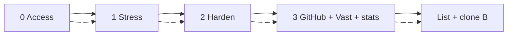
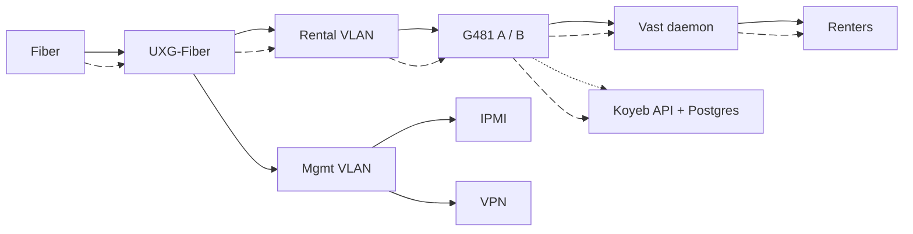
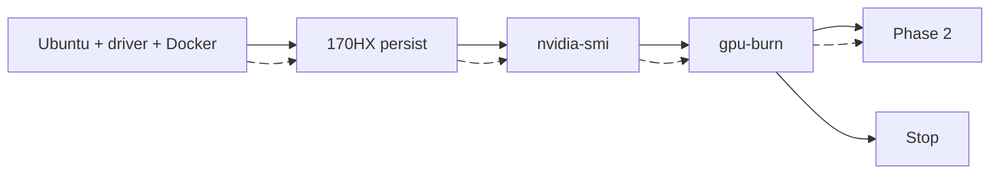
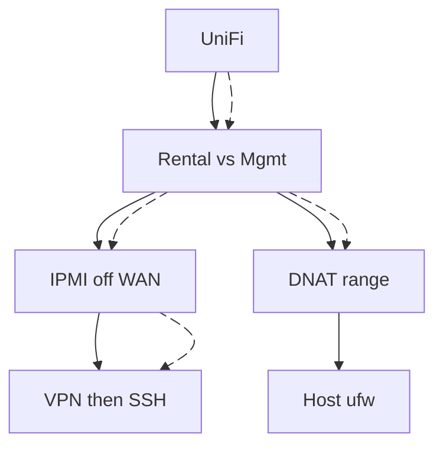
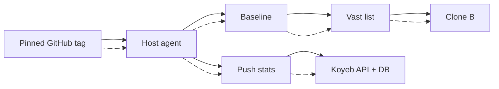
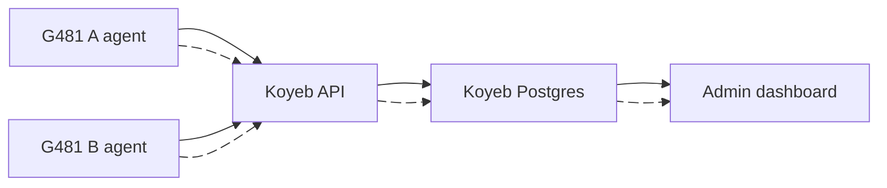

# Bryan x Eqan Ahmad

Linux / Docker / Python | Two G481-HA0 hosts on Vast.ai

**Positioning:** Burn, harden, pin and list. Stats live off the GPU hosts.

---

## Three Phases

| Phase | Done when | Stop if |
|---|---|---|
| 0 | VPN, IPMI, public IP, GPU count | CGNAT or no access |
| 1 | **gpu-burn** stable | unlock, heat, PSU |
| 2 | IPMI dark, DNAT range | mgmt on WAN |
| 3 | listed, B cloned, stats in DB | would change drivers live |

---

## Site

Renters: UniFi DNAT. Admin SSH: VPN. Stats: HTTPS push to Koyeb, not on the G481s.

---

## Phase 0: Access

| Need | Why |
|---|---|
| VPN + SSH + IPMI | remote |
| On-site hands | GPU, PSU, POST |
| Public IP, not CGNAT | Vast inbound |
| GPU count, 8 vs 10 GB | same-model listing |
| Both sockets live | dual-root |
| Vast hosting account | not a renter account |

---

## Phase 1: Stress

Thin stack only. `oguzpastirmaci/gpu-burn --gpus all`. Watch heat. List as CMP 170HX, not A100.

---

## Phase 2: Harden (I own)

| I configure | Not this job |
|---|---|
| Zones, UPnP off, IDS/IPS | Pen test |
| IPMI private, SSH keys | Cloudflare on renter ports |
| DNAT range, host ufw | Renter isolation (Vast) |
| 10G uplinks | On-site cabling |

---

## Phase 3: GitHub + Vast

| Do | Do not |
|---|---|
| Read-only deploy key | Write token on the GPU host |
| Pin tag, unlist then apply | Follow `main` or live driver update |
| Tiny metrics agent on G481 | Postgres / API on G481 |

---

## Stats DB + Admin Dashboard

| Store | Do not store |
|---|---|
| Temp, power, GPU util, VRAM | Renter containers / models |
| Disk, RAM, daemon up/down | Vast customer data |
| Burn history, downtime | DB or API on a G481 |

Agents: outbound HTTPS + token. Dashboard: login. Two hosts will not need much scale; Koyeb is so we do not babysit a stats VM. Keep Postgres warm enough that ingest does not sleep.

---

## Close

Burn. Harden. Pin, list, push stats to Koyeb. No listing without load. No database on the rental GPUs.

